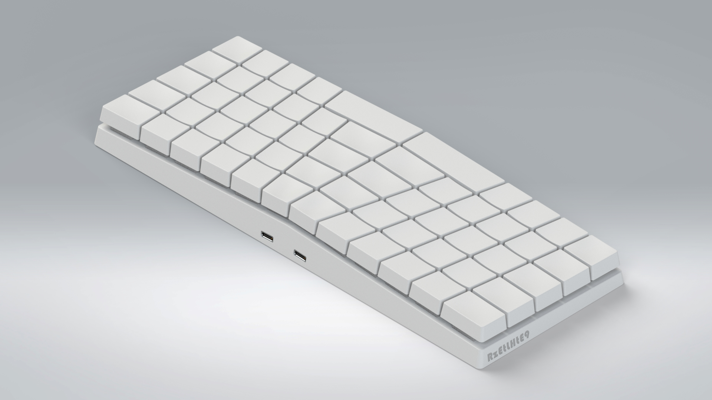

## RzEtLHtE9

A keyboard that tends to be excellent in ergonomics, is manufactured using a 3D printer, the controller is independent, and traditional mechanical keyboard accessories are used.

## 3D printing guide

Looking for a reliable "SLA 3D printing" service provider.If you are not familiar with the printed materials, inform the service provider:"Need to achieve the effect of similar injection molding, no odor, no visible deformation. In short, try to achieve the desired effect". --->>Print "test.STL" model.The test model meets the aforementioned requirements before all models can be printed.

Tip:The size of each button is different, there is no mark due to computer performance problems. Inform the service provider that the left and right buttons are packed separately.

## PCB Guide

The left and right PCBs are universal and symmetrical layout. Open the PCB file to obtain the required information.

Tip:PCB outline can only be 0~negative-tolerance

## Keyboard Controller Guide

Use USB_Type-C interface, PCB thickness <= 2mm, length 90mm_max, width 25mm_max. There are many keyboard controllers available in the world, for example: ProMicro...
The control of the Micro_USB interface can also be installed.

## Firmware guide
TMK/QMK is currently available, making button maps...Many tutorials can be found on the Internet.

## Bill of materials
- RzEtLHtE9 Body 1/PCS ##

- Regular size keyboard switch 60/PCS

- Balance shaft 2/SET (L24mm)

- Switching diode 60/PCS ##If you have left and right PCBs, use "1N4148W(SOD-123)" . No left and right PCBs are manufactured, use "1N4148(DO-35)"

- Left and right PCB (optional). Keyboard controller 1 / PCS ##ProMicro or other

- Welding tool + hot melt glue gun + wire (according to your preferences)

## Preview

## RzEtLHtE9 of ShionKeys

This project is still a baby,it needs your [support](https://ipfs.io/ipfs/QmWTQaGFr31ewhrwZc4TnvorQembkwZ3v7UQoE8yHPgh5z/investor/).
